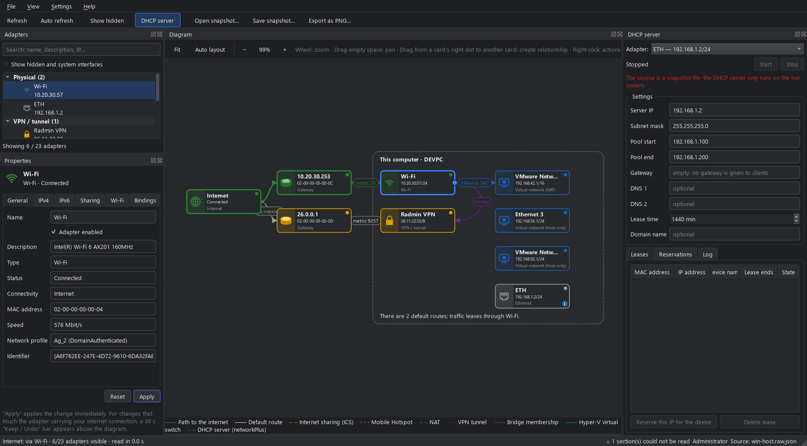
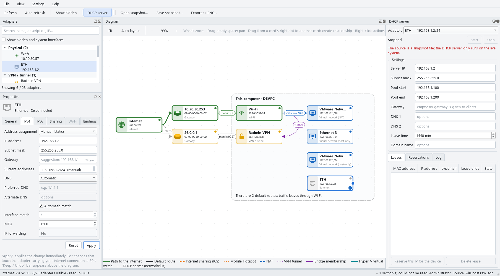
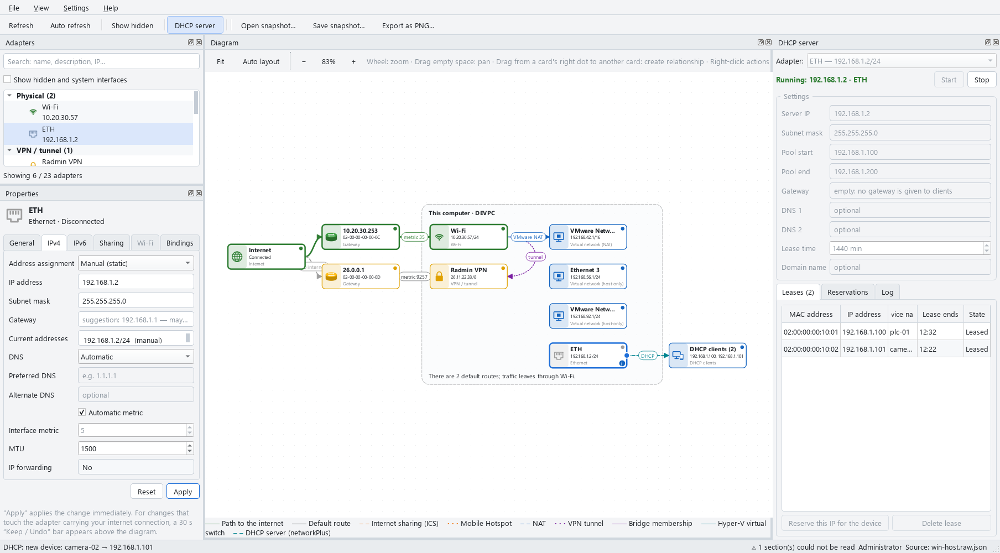
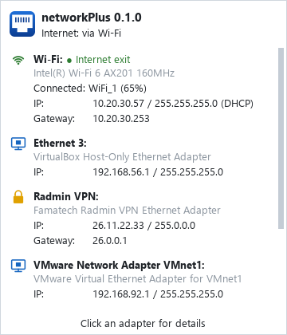
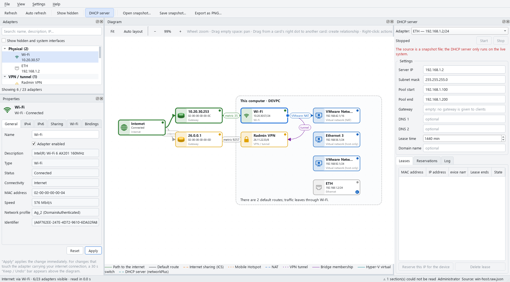

# networkPlus

**See your PC's network adapters as a diagram — and configure them from it.**

networkPlus draws every network adapter on your computer, how they connect to the internet and
how they relate to each other (Internet Connection Sharing, bridges, VM networks, VPN tunnels…)
as a live node–edge diagram. Select an adapter to change its settings, or drag a line from one
adapter to another to share the internet between them.

**Türkçe:** [README.tr.md](README.tr.md)



## Download

From [Releases](https://github.com/mcansiz/NetworkPlus/releases), no installation:

| Platform | File |
|---|---|
| Windows 10/11 (64-bit) | `networkPlus-<version>-windows-x64.exe` — single file |
| Linux (64-bit, NetworkManager) | `networkPlus-<version>-x86_64.AppImage` — `chmod +x`, glibc 2.17+ |
| macOS 11+ (Apple Silicon), experimental | `networkPlus-<version>-macos-arm64.zip` — opens saved snapshots only (no live network reading on macOS) |

> The packages are not code-signed yet: Windows SmartScreen may warn on first start ("More info →
> Run anyway"); on macOS right-click the app → Open. Releases are built and tested by GitHub Actions
> on all three platforms.

## Features

**Diagram**
- Layered view: Internet → gateway/router → adapters → downstream networks.
- Relationships drawn as labelled edges: active default route, Internet Connection Sharing (ICS),
  Mobile Hotspot, VMware/VirtualBox NAT and host-only networks, VPN tunnels, bridges, Hyper-V
  virtual switches, and clients of the built-in DHCP server.
- Status colours (internet / local only / disconnected / problem), badges for issues
  (APIPA address, duplicate default routes…), movable cards and panels, PNG export.
- **Drag from one adapter to another** to share the internet (ICS) or create a bridge (Linux).

**Adapter settings** — from the properties panel, the right-click menu or the card's buttons
- IPv4: DHCP or static (address, subnet mask, gateway) with smart defaults, DNS, interface metric,
  MTU, enable/disable, rename (Windows), renew DHCP lease, turn ICS on/off.
- Changes apply immediately. If a change touches the adapter that carries your internet connection,
  a **30-second “Keep / Undo” bar** appears and the change is rolled back automatically if you don't
  confirm (like changing screen resolution).
- Optional batch mode: queue several changes, undo/redo, review the plan and generated script,
  apply them all with a single administrator prompt.



**Built-in DHCP server**
- Hand out addresses on a spare adapter, e.g. to configure a PLC, camera or embedded board on a
  direct cable: address pool, subnet mask, optional gateway and DNS, lease time, domain name.
- Leases table, MAC → IP reservations (one click from a lease), activity log; clients appear on the
  diagram; tray notification when a new device joins.
- Safety first: it refuses to run on the adapter that carries your internet connection, on an
  adapter that already gets its address from a DHCP server, or where internet sharing is active —
  so it can't become a rogue DHCP server on your office or home network.
- No static address yet? "Set static IP and start" does both in one step.



**System tray**
- Status icon (green: internet, amber: local only, grey: none); hover it for a summary of every
  adapter — addresses, masks, gateways, Wi-Fi network and signal. Click an adapter to open it.
- Quick enable/disable and DHCP renew from the tray menu, notifications when the connection changes.
- Start with the system (normal user, or as administrator via Task Scheduler without a UAC prompt),
  minimise / close to tray.



**Look and language**
- Light, dark or automatic theme (follows the system setting). Themes are plain `.qss` files —
  add your own via *Settings › Theme › Open themes folder*.
- 7 languages: English, Türkçe, Deutsch, Русский, Español, Français, 简体中文
  (follows the system language, switchable in *Settings › Language*).



## Platforms

| | Windows 10 / 11 | Linux (NetworkManager) |
|---|---|---|
| Reading the network | PowerShell (built in), no admin rights | `ip -j`, `nmcli` |
| Applying changes | elevated PowerShell script (UAC) | `nmcli` via `pkexec` |
| ICS / sharing | Windows ICS (`HNetCfg`) | NetworkManager “shared” |
| Bridges | shown only | create / remove |
| DHCP server | ✔ (adds a firewall rule for UDP 67 once) | ✔ (`pkexec`) |

Reading the network never needs administrator rights; you're asked once per apply, or the app
can start elevated.

## Status and limitations

networkPlus is young (0.2.0, **pre-release**). Please read before changing settings on a machine
you depend on:

- Applying changes has been tested on Linux (automated tests in a VM) and partially on Windows
  (by the maintainer). Risky changes are protected by the automatic rollback described above, but
  keep another way to reach the machine if you're working remotely.
- Never start the DHCP server on a network that already has one; the built-in checks catch the
  common cases, not every one.
- Translations other than Turkish and English were machine-assisted and need native review —
  corrections are very welcome.
- Advanced driver properties (the driver's “Advanced” tab: speed/duplex, Jumbo, offloads, MAC address…)
  can be changed on Windows; the adapter restarts briefly. Not available on Linux.
- Not supported yet: IPv6 editing, Windows bridges, Wi-Fi hotspot control.

## Run from source

Requires Python 3.10+ and PyQt5 5.15.

```bash
pip install -r requirements.txt
python main.py                                              # live system
python main.py --snapshot tests/fixtures/win-host.raw.json  # sample data, changes nothing
```

## Build a single-file executable

PyInstaller, one shared spec (`packaging/networkplus.spec`). Each script creates its own virtual
environment inside the project, runs the tests, builds and smoke-tests the result in `dist/`.

```bash
./build_win.sh       # Windows (Git Bash)  → dist/networkPlus-<version>-windows-x64.exe
./build_linux.sh     # Linux               → dist/networkPlus-<version>-linux-x64 (needs this glibc or newer)
./build_appimage.sh  # Linux AppImage      → dist/networkPlus-<version>-x86_64.AppImage (glibc 2.17+)
./build_macos.sh     # macOS (experimental) → dist/networkPlus-<version>-macos-<arch>.zip
```

GitHub Actions (`.github/workflows/`) runs the tests on Linux, Windows and macOS for every push;
pushing a `v*` tag builds all three packages and creates a draft release.

On Debian/Ubuntu/Mint, `sudo apt install python3-venv` may be needed first. Set `SKIP_TESTS=1`
to skip the test step.

## Development

- **UI:** every module has a Qt Designer file, loaded at runtime (no compile step):
  `src/networkplus/ui/modules/<module>/<module>.ui`. Open them with Qt 5.15 Designer.
- **Architecture:** `core/` (pure Python: model, relationship analysis, change plans, DHCP logic) ·
  `platform/` (the only layer that touches the OS) · `ui/` (PyQt5).
- **Tests:** `python -m unittest discover -s tests -v` — they use recorded, anonymised snapshots
  and never change your network. CI runs them on Linux, Windows and macOS.
- **Translations:** `src/networkplus/i18n/*.ts` (Qt Linguist format).
  `python tools/i18n_update.py` collects new strings; `--check` reports missing ones.
- **Themes:** `src/networkplus/ui/themes/*.qss`; the palette lives in the file header (`@palette`).
- **Screenshots in this README:** `python tools/make_screenshots.py`.
- Design notes and decision records (in Turkish): [`.claude/`](.claude/) — start with
  [`docs/architecture.md`](.claude/docs/architecture.md) and [`decisions/`](.claude/decisions/).

Issues and pull requests are welcome.

## License

GNU General Public License v3.0 — see [LICENSE](LICENSE).
