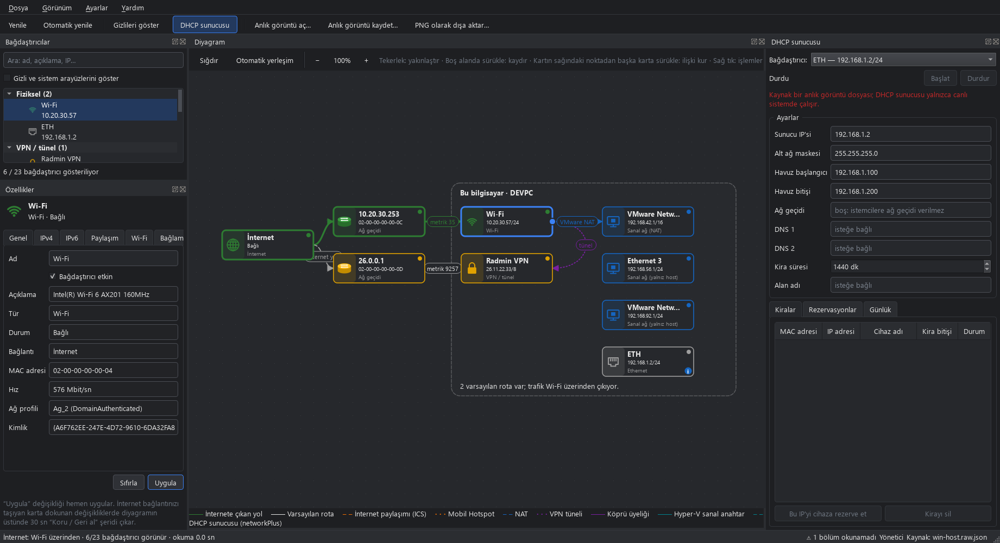
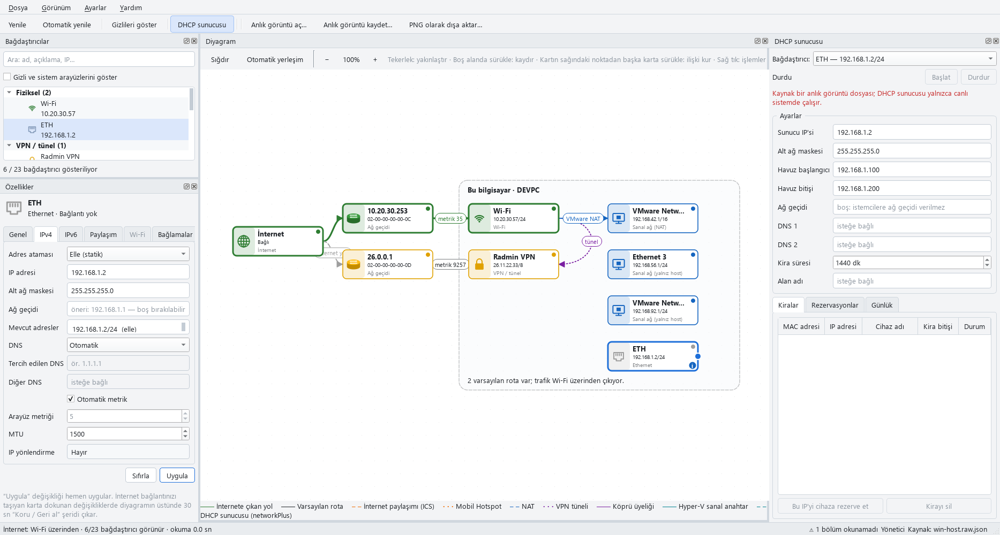
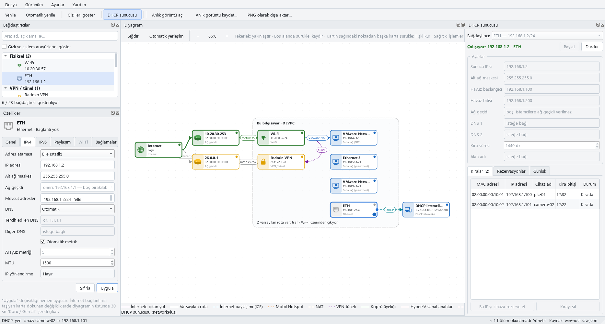
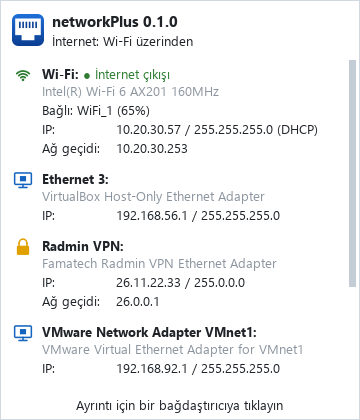
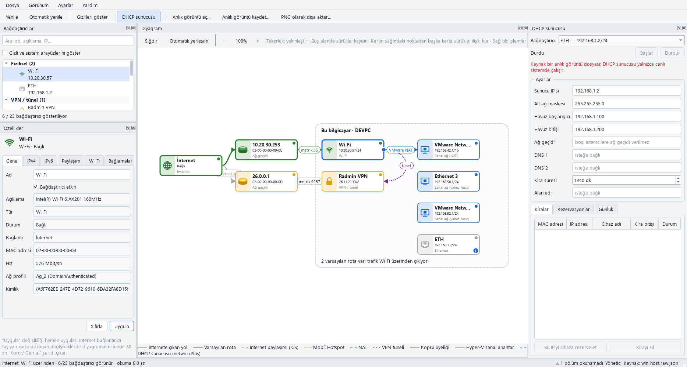

# networkPlus

**Bilgisayarınızın ağ bağdaştırıcılarını diyagram olarak görün — ve oradan ayarlayın.**

networkPlus bilgisayarınızdaki tüm ağ bağdaştırıcılarını, internete nasıl çıktıklarını ve
birbirleriyle ilişkilerini (İnternet Bağlantısı Paylaşımı, köprü, sanal makine ağları, VPN
tünelleri…) canlı bir düğüm–kenar diyagramında çizer. Bir bağdaştırıcıyı seçip ayarlarını
değiştirebilir ya da bir karttan diğerine çizgi çekerek interneti paylaştırabilirsiniz.

**English:** [README.md](README.md)



## İndir

Windows 10/11, tek dosya, kurulum yok:
**[Sürümler → networkPlus-0.1.0-windows-x64.exe](https://github.com/mcansiz/NetworkPlus/releases)**

> Exe henüz imzalı değil; Windows SmartScreen ilk açılışta uyarabilir ("Ek bilgi → Yine de
> çalıştır"). Linux'ta kaynaktan çalıştırın ya da tek dosyayı kendiniz derleyin (aşağıda).

## Özellikler

**Diyagram**
- Katmanlı görünüm: İnternet → ağ geçidi/router → bağdaştırıcılar → aşağı akış ağları.
- İlişkiler etiketli kenar olarak: etkin varsayılan rota, İnternet paylaşımı (ICS), Mobil Hotspot,
  VMware/VirtualBox NAT ve yalnız-host ağları, VPN tünelleri, köprüler, Hyper-V sanal anahtarları
  ve yerleşik DHCP sunucusunun istemcileri.
- Durum renkleri (internet / yalnız yerel / bağlı değil / sorun), sorun rozetleri (APIPA adresi,
  birden çok varsayılan rota…), taşınabilir kartlar ve paneller, PNG dışa aktarma.
- **Bir karttan diğerine sürükleyerek** interneti paylaştırın (ICS) ya da köprü kurun (Linux).

**Bağdaştırıcı ayarları** — özellikler panelinden, sağ tık menüsünden ya da kart düğmelerinden
- IPv4: DHCP ya da statik (adres, alt ağ maskesi, ağ geçidi; akıllı varsayılanlarla), DNS, arayüz
  metriği, MTU, etkinleştir/devre dışı bırak, yeniden adlandır (Windows), DHCP kirasını yenile,
  ICS'i aç/kapat.
- Değişiklikler hemen uygulanır. İnternet bağlantınızı taşıyan karta dokunan bir değişiklikte
  **30 saniyelik "Koru / Geri al" şeridi** çıkar; onaylamazsanız değişiklik kendiliğinden geri
  alınır (ekran çözünürlüğü değiştirmedeki gibi).
- İsteğe bağlı toplu kip: birden çok değişikliği kuyruğa alın, geri al/yinele, planı ve üretilen
  betiği inceleyin, hepsini tek yönetici onayıyla uygulayın.



**Yerleşik DHCP sunucusu**
- Boştaki bir kartta adres dağıtın; ör. doğrudan kabloyla bağlı bir PLC, kamera ya da gömülü kartı
  ayarlamak için: adres havuzu, alt ağ maskesi, isteğe bağlı ağ geçidi ve DNS, kira süresi, alan adı.
- Kiralar tablosu, MAC → IP rezervasyonu (kiradan tek tıkla), günlük; istemciler diyagramda
  görünür; yeni cihaz bağlanınca tepsi bildirimi.
- Önce güvenlik: internet bağlantınızı taşıyan kartta, adresini zaten bir DHCP sunucusundan alan
  kartta ya da internet paylaşımı açık kartta çalışmayı reddeder — böylece ofis veya ev ağınızda
  sahte bir DHCP sunucusu olamaz.
- Kartta statik adres yok mu? "Karta statik IP ver ve başlat" ikisini tek adımda yapar.



**Sistem tepsisi**
- Durum simgesi (yeşil: internet, sarı: yalnız yerel, gri: yok); üzerine gelince her kartın özeti
  açılır — adresler, maskeler, ağ geçitleri, Wi-Fi ağı ve sinyal. Karta tıklayınca o kart açılır.
- Tepsi menüsünden hızlı etkinleştir/devre dışı bırak ve DHCP yenileme; bağlantı değişince bildirim.
- Sistemle başlatma (normal kullanıcı ya da Görev Zamanlayıcı ile UAC sormadan yönetici),
  küçültünce/kapatınca tepsiye.



**Görünüm ve dil**
- Açık, koyu ya da otomatik tema (sistem ayarını izler). Temalar düz `.qss` dosyalarıdır —
  kendinizinkini *Ayarlar › Tema › Tema klasörünü aç* ile ekleyin.
- 7 dil: Türkçe, English, Deutsch, Русский, Español, Français, 简体中文
  (sistem dilini izler, *Ayarlar › Dil* ile değiştirilir).



## Platformlar

| | Windows 10 / 11 | Linux (NetworkManager) |
|---|---|---|
| Ağı okuma | PowerShell (yerleşik), yönetici yetkisi gerekmez | `ip -j`, `nmcli` |
| Değişiklik uygulama | yükseltilmiş PowerShell betiği (UAC) | `pkexec` ile `nmcli` |
| ICS / paylaşım | Windows ICS (`HNetCfg`) | NetworkManager "shared" |
| Köprü | yalnız gösterilir | kur / kaldır |
| DHCP sunucusu | ✔ (UDP 67 için bir kez güvenlik duvarı kuralı) | ✔ (`pkexec`) |

Ağı okumak hiçbir zaman yönetici yetkisi istemez; uygulama başına bir kez sorulur ya da uygulama
yönetici olarak başlayabilir.

## Durum ve sınırlamalar

networkPlus yeni (0.1.0, **ön sürüm**). Güvendiğiniz bir makinede ayar değiştirmeden önce okuyun:

- Değişiklik uygulama Linux'ta (sanal makinede otomatik testlerle) ve kısmen Windows'ta (geliştirici
  tarafından) denendi. Riskli değişiklikler yukarıdaki otomatik geri alma ile korunur; yine de uzaktan
  çalışıyorsanız makineye ulaşmanın başka bir yolunu hazır tutun.
- DHCP sunucusunu zaten DHCP sunucusu olan bir ağda başlatmayın; yerleşik denetimler yaygın
  durumları yakalar, her durumu değil.
- Türkçe ve İngilizce dışındaki çeviriler yapay zekâ yardımıyla yapıldı, anadil gözden geçirmesi
  gerekiyor — düzeltmeler memnuniyetle karşılanır.
- Henüz yok: IPv6 düzenleme, Windows'ta köprü, Wi-Fi hotspot denetimi, gelişmiş sürücü özellikleri.

## Kaynaktan çalıştırma

Python 3.10+ ve PyQt5 5.15 gerekir.

```bash
pip install -r requirements.txt
python main.py                                              # canlı sistem
python main.py --snapshot tests/fixtures/win-host.raw.json  # örnek veri, hiçbir şeyi değiştirmez
```

## Tek dosya derleme

PyInstaller, ortak spec (`packaging/networkplus.spec`). Her betik proje içinde kendi sanal ortamını
kurar, testleri çalıştırır, derler ve `dist/` altındaki sonucu sınar.

```bash
./build_win.sh      # Windows (Git Bash)  → dist/networkPlus-<sürüm>-windows-x64.exe
./build_linux.sh    # Linux               → dist/networkPlus-<sürüm>-linux-x64
```

Debian/Ubuntu/Mint'te önce `sudo apt install python3-venv` gerekebilir. Test adımını atlamak için
`SKIP_TESTS=1`.

## Geliştirme

- **Arayüz:** her modülün çalışma anında yüklenen bir Qt Designer dosyası vardır (derleme gerekmez):
  `src/networkplus/ui/modules/<modül>/<modül>.ui`. Qt 5.15 Designer ile açın.
- **Mimari:** `core/` (saf Python: model, ilişki analizi, değişiklik planı, DHCP mantığı) ·
  `platform/` (işletim sistemine dokunan tek katman) · `ui/` (PyQt5).
- **Testler:** `python -m unittest discover -s tests -v` — kayıtlı, anonimleştirilmiş anlık
  görüntülerle çalışır, ağınızı asla değiştirmez.
- **Çeviriler:** `src/networkplus/i18n/*.ts` (Qt Linguist biçimi). `python tools/i18n_update.py`
  yeni metinleri toplar; `--check` eksikleri bildirir.
- **Temalar:** `src/networkplus/ui/themes/*.qss`; palet dosyanın başındadır (`@palette`).
- **Bu README'deki ekran görüntüleri:** `python tools/make_screenshots.py`.
- Tasarım notları ve karar kayıtları: [`.claude/`](.claude/) — önce
  [`docs/architecture.md`](.claude/docs/architecture.md) ve [`decisions/`](.claude/decisions/).

Hata bildirimleri ve katkılar memnuniyetle karşılanır.

## Lisans

GNU Genel Kamu Lisansı v3.0 — bkz. [LICENSE](LICENSE).
